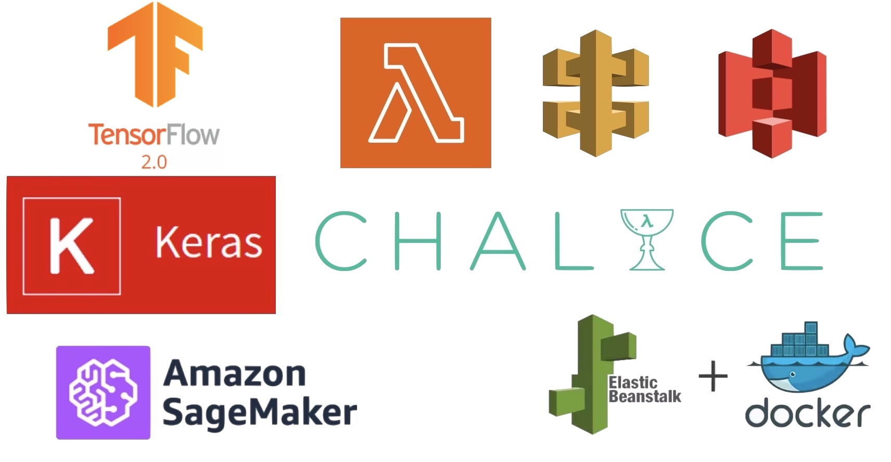

# Deploying Deep Learning Apps on AWS

The course introduces students to tensorflow and keras for trainining and optimizing deep learning models. We use a combination of AWS services (Sagemaker endpoints, lambda functions, API Gateway, S3 static website, ElasticBeanstalk, Chalice) to deploy the trained model to the web for inference. We learn three modalities for deployment: static website (via S3 and API Gateway), web server (via ElasticBeanstalk) and serverless (via Chalice and Lambda).

### Part 1. Introduction
- Introduction to AWS
- Working with Amazon Sagemaker
- Setting up your IDE

### Part 2. Building Deep Learning Models with Tensorflow and Keras

- Introduction to Deep Learning
- Introduction to the Sequential API
- Feed-forward Networks
- Optimizing your model
- Convolutional Neural Nets
- Recurrent Neural Nets for NLP and Time-Series

### Part 3. Deploying your Model using Elastic Beanstalk
- Introduction to Flask
- Adding your .h5 trained model
- Deployment with Elastic Beanstalk and Docker
- Deployment using a Sagemaker Endpoint

### Part 4. Serverless Deployment
- Introduction to Serverless
- Deployment using S3, API Gateway, Lambda, and a Sagemaker Serverless Endpoint
- Building an application with AWS Chalice
- Deployment with Chalice
